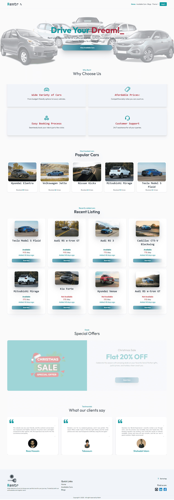

<h1> Rentr</h1>

<strong>A car rental platform</strong> where users can browse, rent, add, and manage cars and bookings. Built using the <strong>MERN stack</strong>, with authentication via Firebase and secured API endpoints using JSON Web Token (JWT) and Axios interceptors.

<h2>🚀 Technologies Used</h2>

  
  
  
  
  
  

<h2>✨ Core Features</h2>
<ul>
  <li>✅ Browse available cars from the homepage and dedicated listings page.</li>
  <li>✅ <strong>User Authentication</strong> with Firebase (Login & Registration).</li>
  <li>✅ <strong>Car Management</strong>: Users can add, view, and manage their cars.</li>
  <li>✅ <strong>Booking System</strong>: Rent cars and manage bookings with ease.</li>
  <li>✅ Fully <strong>responsive design</strong>, optimized for both mobile and desktop.</li>
</ul>

<h2>📦 Dependencies</h2>
<ul>
  <li><strong>Frontend:</strong>
    <ul>
      <li>react (^18.3.1)</li>
      <li>react-dom (^18.3.1)</li>
      <li>react-router-dom (^7.1.0)</li>
      <li>react-icons (^5.4.0)</li>
      <li>react-tooltip (^5.28.0)</li>
      <li>sweetalert2 (^11.15.3)</li>
    </ul>
  </li>
  <li><strong>Authentication:</strong>
    <ul>
      <li>firebase (^11.1.0)</li>
    </ul>
  </li>
  <li><strong>Styling:</strong>
    <ul>
      <li>tailwindcss (^3.4.17)</li>
      <li>daisyui (^4.12.22)</li>
      <li>animate.css (^4.1.1)</li>
    </ul>
  </li>
  <li><strong>Other:</strong>
    <ul>
      <li>axios (^1.7.9)</li>
      <li>lottie-react (^2.4.0)</li>
      <li>moment (^2.30.1)</li>
      <li>motion (^11.15.0)</li>
      <li>react-dropzone (^14.3.5)</li>
      <li>react-helmet-async (^2.0.5)</li>
      <li>react-responsive-carousel (^3.2.23)</li>
      <li>react-responsive-modal (^6.4.2)</li>
      <li>react-simple-typewriter (^5.0.1)</li>
      <li>recharts (^2.15.0)</li>
    </ul>
  </li>
</ul>

<em>(Full dependencies list available in <code>package.json</code>.)</em>

<h2>🛠️ Installation & Running Locally</h2>

Follow these steps to set up <strong>Rentr</strong> on your local machine:

<h3>1️⃣ Clone the Repository</h3>
<pre><code>git clone https://github.com/your-username/rentr.git
cd rentr</code></pre>

<h3>2️⃣ Install Dependencies</h3>
<pre><code>npm install</code></pre>

<h3>3️⃣ Set Up Environment Variables</h3>

Create a <code>.env.local</code> file and add the following:

<pre><code>VITE_apiKey=YOUR_FIREBASE_API_KEY
VITE_authDomain=YOUR_FIREBASE_AUTH_DOMAIN
VITE_projectId=YOUR_FIREBASE_PROJECT_ID
VITE_storageBucket=YOUR_FIREBASE_STORAGE_BUCKET
VITE_messagingSenderId=YOUR_FIREBASE_MESSAGING_SENDER_ID
VITE_appId=YOUR_FIREBASE_APP_ID</code></pre>

<em>(Replace with your actual Firebase credentials.)</em>

<h3>4️⃣ Start the Development Server</h3>
<pre><code>npm run dev</code></pre>

The project will run at <code>http://localhost:5173/</code> by default.

<h2>🌐 Live Demo</h2>
<ul>
  <li>🚀 <a href="https://rentr-ashky.web.app/">Firebase Deployment</a></li>
  <li>🚀 <a href="https://rentr-ashis263.netlify.app/">Netlify Deployment</a></li>
</ul>

<h2>🤝 Contribution</h2>

Feel free to fork the repository and submit a pull request. For major changes, please open an issue first to discuss what you’d like to improve.

<h2>📸 Screenshot</h2>
